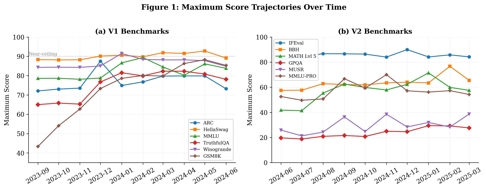
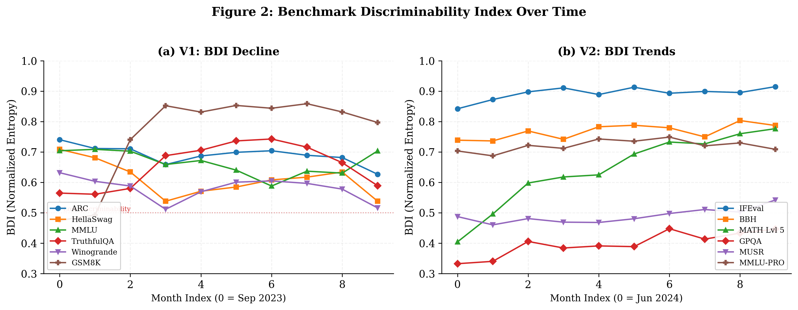
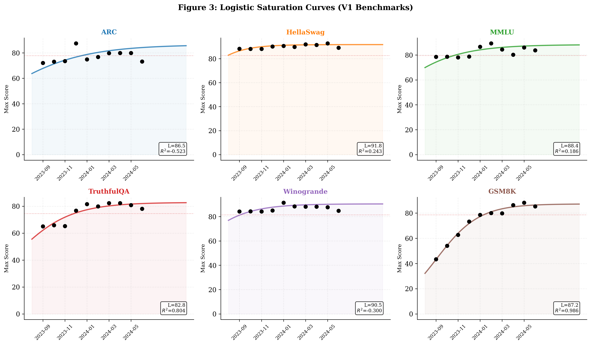
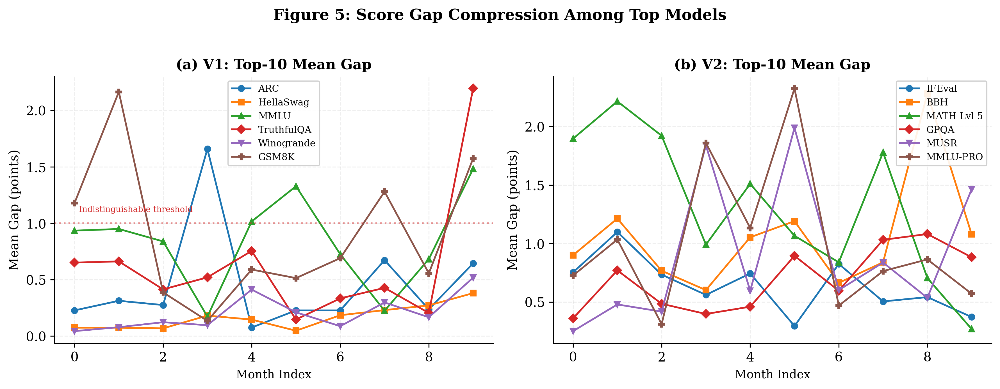

# 📉 Benchmark Saturation

**Benchmark Saturation: A Statistical Analysis of Score Compression Across LLM Leaderboards**

[](paper/main.pdf)
[](LICENSE)
[](https://huggingface.co/spaces/open-llm-leaderboard/open_llm_leaderboard)

> We analyze **11,836 model evaluations** across **12 benchmarks** spanning two generations of the HuggingFace Open LLM Leaderboard to quantify when and how benchmarks lose their ability to distinguish between models. We introduce the **Benchmark Discriminability Index (BDI)**, an entropy-based metric for monitoring benchmark health.

---

## 📊 Key Results

<p align="center">
  
</p>

| Finding | Detail |
|---------|--------|
| V1 BDI decline | **15–24%** loss of discriminability within 10 months |
| HellaSwag & Winogrande | Saturated **before tracking began** (top-10 gap < 1 point) |
| GSM8K logistic fit | **R² = 0.986** — near-perfect saturation curve |
| IFEval (V2) | Already at **CP = 0.90** — first V2 benchmark approaching saturation |
| GPQA headroom | **CP = 0.29** — most remaining room for growth |
| MATH Lvl 5 | Observed max (71.5) **exceeds** projected ceiling (70.5) |

All BDI changes are statistically significant at the 95% level via bootstrap confidence intervals (1,000 resamples).

---

## 🧮 The Benchmark Discriminability Index (BDI)

BDI quantifies a benchmark's ability to differentiate models using **normalized Shannon entropy** over the score distribution:

$$\text{BDI}(t) = \frac{H(\mathbf{p}_t)}{H_{\max}} = \frac{-\sum_{i=1}^{B} p_i(t) \log_2 p_i(t)}{\log_2 B}$$

- **BDI → 1**: Scores spread across the full range (high discriminability)
- **BDI → 0**: All models scoring in the same bin (complete saturation)

<p align="center">
  
</p>

Complemented by **Top-K Gap** (score spread among top models) and **Ceiling Proximity** (how close the max score is to 100).

---

## 📈 Saturation Curves

We fit logistic growth curves to maximum score trajectories:

$$s_{\max}(t) = \frac{L}{1 + e^{-k(t - t_0)}}$$

<p align="center">
  
</p>

| Benchmark | R² | Projected Ceiling | Status |
|-----------|-----|-------------------|--------|
| GSM8K | **0.986** | 87.2 | Near-perfect fit |
| GPQA | **0.860** | 70.5 | Good fit, high headroom |
| TruthfulQA | **0.804** | 82.8 | Good fit |
| BBH | 0.554 | >100 | OK fit |
| MATH Lvl 5 | 0.619 | 70.5† | Ceiling already exceeded |
| HellaSwag | 0.243 | — | Poor fit (already saturated) |
| Winogrande | −0.300 | — | Poor fit (already saturated) |

*We report ceiling projections only for R² > 0.5. Poor fits are expected when only the plateau is observed.*

---

## 🚦 Saturation Status: All 12 Benchmarks

<p align="center">
  
</p>

### Proposed Retirement Criteria

A benchmark should be considered for retirement when **all three** are met:

| Criterion | Threshold | Rationale |
|-----------|-----------|-----------|
| Ceiling Proximity | > 0.90 | Max scores within 10% of theoretical ceiling |
| Top-10 Gap | < 1.0 point | Top models indistinguishable within noise |
| BDI Decline | > 15% from peak | Significant loss of discriminative power |

By these criteria, **HellaSwag and Winogrande were due for retirement by late 2023**—roughly 6 months before HuggingFace actually retired them.

---

## 📦 Data

All data is publicly available on the HuggingFace Hub (no API keys needed):

| Dataset | Source | Models | Benchmarks | Period |
|---------|--------|--------|------------|--------|
| V1 | [`open-llm-leaderboard-old/contents`](https://huggingface.co/datasets/open-llm-leaderboard-old/contents) | 7,260 | ARC, HellaSwag, MMLU, TruthfulQA, Winogrande, GSM8K | Jul 2023 – Jun 2024 |
| V2 | [`open-llm-leaderboard/contents`](https://huggingface.co/datasets/open-llm-leaderboard/contents) | 4,576 | IFEval, BBH, MATH Lvl 5, GPQA, MUSR, MMLU-PRO | Jun 2024 – Mar 2025 |

**Total cost: $0** — entirely public data.

---

## 🔬 Knowledge vs. Reasoning

<p align="center">
  
</p>

Knowledge-retrieval benchmarks (ARC, HellaSwag, MMLU, Winogrande) showed ceiling proximity above 85% from the earliest observations. GSM8K—the sole V1 reasoning benchmark—started at 43% and took 7+ months to approach saturation. The pattern repeats in V2: IFEval approaches saturation while GPQA (graduate-level reasoning) retains substantial headroom.

**Takeaway:** Knowledge can be memorized from training data; reasoning capabilities improve more gradually. Evaluation suites should increasingly emphasize reasoning tasks to extend useful lifetime.

---

## 🚀 Quick Start

```bash
# Clone
git clone https://github.com/Abelo9996/benchmark-saturation.git
cd benchmark-saturation

# Install dependencies
pip install pandas numpy scipy matplotlib seaborn

# Download data (requires datasets library)
pip install datasets
python download_data.py

# Run full analysis pipeline
python analysis.py

# Generate publication-quality figures
python generate_figures_v2.py
```

---

## 📁 Repository Structure

```
benchmark-saturation/
├── analysis.py              # Full analysis pipeline (BDI, saturation fits, metrics)
├── generate_figures_v2.py   # Publication-quality figure generation
├── download_data.py         # Download V1 + V2 from HuggingFace Hub
├── review_fixes.py          # Bootstrap CIs, sensitivity analysis
├── bdi_results.csv          # Pre-computed BDI results
├── saturation_fits.json     # Logistic curve fit parameters
├── figures/                 # Exploratory figures
├── paper/
│   ├── main.tex             # LaTeX source
│   ├── main.pdf             # Compiled paper (10 pages)
│   ├── references.bib       # Bibliography (24 references)
│   └── figures/             # Publication figures (PDF + PNG)
└── data/                    # Downloaded parquet files (gitignored)
```

---

## 📄 Citation

```bibtex
@article{yagubyan2026benchmarksaturation,
  title={Benchmark Saturation: A Statistical Analysis of Score Compression Across {LLM} Leaderboards},
  author={Yagubyan, Abel},
  year={2026},
  note={Preprint}
}
```

---

## 📜 License

MIT

---

*Part of a series on LLM evaluation reliability. See also: [Agent Consistency](https://github.com/Abelo9996/agent-consistency).*
